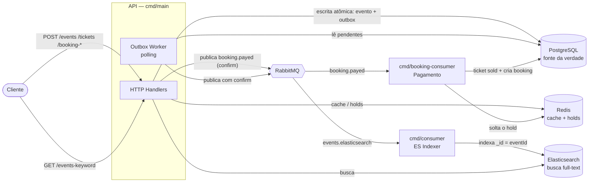

# 🎟️ Ticketing — um estudo de System Design inspirado no Ticketmaster

Aplicação backend em **Go** que simula parte do design de uma plataforma de venda de ingressos (estilo **Ticketmaster**): criação de eventos, geração de ingressos, busca full-text, reserva temporária de assentos e um fluxo de pagamento assíncrono — tudo com foco nos **problemas reais de system design** desse domínio: **concorrência na compra**, **consistência entre serviços** e **comunicação assíncrona**.

> ⚠️ Projeto de **estudo**. O objetivo não é ser production-ready, e sim exercitar padrões de arquitetura e as decisões que aparecem quando milhares de pessoas tentam comprar o mesmo ingresso ao mesmo tempo.

---

## 📌 Índice

- [Visão geral](#-visão-geral)
- [Conceitos de System Design aplicados](#-conceitos-de-system-design-aplicados)
- [Arquitetura](#-arquitetura)
- [Fluxos principais](#-fluxos-principais)
- [Modelo de domínio](#-modelo-de-domínio)
- [Endpoints](#-endpoints)
- [Estrutura do projeto](#-estrutura-do-projeto)
- [Stack](#-stack)

---

## 🔎 Visão geral

O sistema é dividido em **fonte da verdade transacional** (PostgreSQL) e **projeções de leitura** (Elasticsearch e Redis), conectadas por **mensageria assíncrona** (RabbitMQ). Isso permite que a **escrita** seja consistente e a **leitura/busca** seja rápida e escalável — o núcleo do padrão **CQRS**.

Três processos independentes compõem a aplicação:

| Binário | Responsabilidade |
|---|---|
| `cmd/main` | API HTTP + **Outbox Worker** (goroutine) |
| `cmd/consumer` | Consome a fila de eventos e **indexa no Elasticsearch** |
| `cmd/booking-consumer` | Consome a fila de pagamentos e **efetiva a compra** |

---

## 🧠 Conceitos de System Design aplicados

Cada item abaixo foi implementado e validado no projeto:

### 1. Transactional Outbox (sem dual-write)
Ao criar um evento, o registro do evento **e** uma linha na tabela `outbox` são gravados na **mesma transação** do Postgres. Isso elimina o problema clássico de *dual-write*: nunca acontece "salvou no banco mas não publicou a mensagem" (ou vice-versa). Ou os dois entram, ou nenhum.

### 2. CQRS — escrita no Postgres, leitura no Elasticsearch
O Postgres é a **fonte da verdade** (escrita). Uma **projeção assíncrona** replica os eventos para o Elasticsearch, que serve a **busca full-text**. A leitura não sobrecarrega o banco transacional.

### 3. Comunicação assíncrona com RabbitMQ
Duas cadeias de mensageria:
- **Eventos:** `outbox → worker (polling) → RabbitMQ → consumer → Elasticsearch`
- **Pagamentos:** `API → RabbitMQ → booking-consumer → Postgres/Redis`

### 4. Entrega *at-least-once* de ponta a ponta
- **Publisher confirms:** o worker só marca a linha da outbox como processada **depois** que o broker confirma (ACK) o recebimento. Nada é publicado "no escuro".
- **Ack manual no consumer:** a mensagem só é confirmada **depois** que o trabalho (indexar no ES / efetivar a compra) dá certo. Se falhar, volta pra fila.

### 5. Idempotência (porque *at-least-once* pode entregar 2x)
- No **Elasticsearch**, o `_id` do documento é o **id do evento** → reprocessar a mesma mensagem faz *overwrite*, não duplica.
- No **booking**, a constraint `UNIQUE(ticket_id)` + tratamento do erro `23505` fazem reprocessar não criar reserva duplicada.

### 6. Concorrência na compra de ingressos (o coração do Ticketmaster)
O problema: *N* pessoas clicam no **último assento** ao mesmo tempo — só **uma** pode ganhar. A solução tem duas camadas:
- **Pré-checagem** (`SeatExists`) → feedback rápido e amigável.
- **Garantia real no banco:** `UNIQUE(event_id, seat)`. Sob concorrência, o `SeatExists` sozinho tem *race condition* (dois passam juntos), mas o **banco rejeita** o segundo `INSERT` de forma atômica → `409 Conflict`.

> ✅ Validado com **10 requisições simultâneas** para o mesmo assento: **1 sucesso, 9 conflitos, zero double-booking**.

### 7. Reserva temporária de assento (hold com TTL)
Ao reservar um assento, uma chave é gravada no **Redis com TTL de 6 minutos** (`unavailable:ticket:{id}`). Na leitura do evento, um **overlay** sobrepõe o status do ingresso para `unavailable` se houver hold. Quando o TTL expira, o assento **volta a ficar disponível sozinho** — sem nenhum `UPDATE` no banco. O Redis é a fonte da verdade do estado *temporário*.

### 8. Cache de leitura
A listagem de eventos (`GET /events`) é cacheada no **Redis** (TTL de 60s), aliviando o Postgres em leituras repetidas.

### 9. Clean Architecture / Ports & Adapters
Camadas bem separadas (domínio → aplicação → infraestrutura → apresentação), com **interfaces (ports)** no domínio/aplicação e **adapters** na infraestrutura. Injeção de dependência manual no `main`. Isso mantém as regras de negócio livres de detalhes de infra (Redis, Postgres, RabbitMQ, ES são plugáveis).

---

## 🏛 Arquitetura



**Camadas (Clean Architecture):**

```
domain          → entidades + interfaces de repositório + erros de domínio
application     → use cases + ports (ex.: Cache)
infrastructure  → persistence (Postgres), cache (Redis), broker (RabbitMQ), esearch
presentation    → controllers HTTP
```

---

## 🔁 Fluxos principais

### Criação de evento + projeção pro Elasticsearch
```
POST /events
  └─ Postgres: INSERT events + INSERT outbox   (mesma transação)
        └─ Outbox Worker (a cada 1s): lê pendentes
              └─ publica no RabbitMQ (com publisher confirm)
                    └─ marca outbox como processada  (só após ACK)
                          └─ cmd/consumer: consome a fila
                                └─ indexa no Elasticsearch (_id = eventId, ack manual)
```

### Busca de eventos (full-text)
```
GET /events-keyword?keyword=metallica
  └─ Elasticsearch: multi_match sobre Name e Description
        └─ retorna os _source dos hits
```

### Compra concorrente de ingresso
```
POST /tickets  (mesmo assento, N requisições simultâneas)
  ├─ SeatExists (pré-checagem)         → feedback rápido
  └─ INSERT tickets → UNIQUE(event_id, seat)
        ├─ 1º: sucesso → 201
        └─ demais: 23505 → ErrSeatTaken → 409 Conflict
```

### Reserva + pagamento (assíncrono)
```
POST /booking-unavailable   → Redis SET unavailable:ticket:{id} (TTL 6min)   [hold]
GET  /events/{id}           → overlay: ticket aparece "unavailable"

POST /booking-payed         → publica no RabbitMQ (confirm) → 202 Accepted
  └─ cmd/booking-consumer: consome booking.payed
        ├─ UPDATE ticket → sold
        ├─ INSERT booking (idempotente via UNIQUE ticket_id)
        └─ Redis DEL do hold  → o ingresso passa a mostrar "sold" de verdade
```

---

## 🧱 Modelo de domínio

```
Event  (1) ───< Ticket (N) ───< Booking >─── User
  id            id                id           id
  name          event_id (FK)     ticket_id    name
  description   price             (FK, UNIQUE)  email
  status        status            seat
  date          seat              user_id
                user_id
```

- **Event 1→N Ticket:** um evento tem muitos ingressos (a FK vive no lado "N").
- **Ticket:** possui `status` (`available` / `unavailable` / `sold`) e `seat`, com **`UNIQUE(event_id, seat)`**.
- **Booking:** liga usuário ↔ ingresso, com **`UNIQUE(ticket_id)`** (um ingresso é reservado por exatamente um usuário).
- **Outbox:** tabela que garante a publicação confiável das mensagens de evento.

---

## 🌐 Endpoints

| Método | Rota | Descrição |
|---|---|---|
| `POST` | `/events` | Cria um evento (grava evento + outbox atomicamente) |
| `GET` | `/events` | Lista eventos com seus ingressos (Postgres + cache Redis) |
| `GET` | `/events/{id}` | Detalhe do evento + ingressos, com **overlay de holds** do Redis |
| `GET` | `/events-keyword?keyword=` | **Busca full-text** no Elasticsearch |
| `POST` | `/tickets` | Cria um ingresso (com controle de concorrência de assento) |
| `POST` | `/booking-unavailable` | Reserva temporária de um assento (**hold** de 6 min no Redis) |
| `POST` | `/booking-payed` | Confirma pagamento → publica no RabbitMQ (processamento assíncrono) |

---

## 📂 Estrutura do projeto

```
cmd/
├── main.go                  # API HTTP + Outbox Worker
├── consumer/                # Consumer: RabbitMQ → Elasticsearch
└── booking-consumer/        # Consumer: RabbitMQ → efetiva a compra

config/                      # Carregamento de configuração (env)

migrations/                  # DDL (aplicado via psql)
├── 001_outbox.sql
├── 002_tickets.sql
├── 003_unique_event_seat.sql
└── 004_bookings.sql

ticket/
├── domain/
│   ├── entities/            # Event, Ticket, Booking, User, Outbox + erros
│   └── repositories/        # interfaces dos repositórios
├── application/
│   ├── ports/               # interfaces (ex.: Cache)
│   └── use-cases/           # regras de negócio (event, ticket, booking)
├── infrastructure/
│   ├── persistence/         # repositórios Postgres
│   ├── cache/               # adapter Redis
│   ├── broker/              # RabbitMQ (publisher/consumer/topologia)
│   │   └── booking/         # publisher/consumer de pagamento
│   └── esearch/             # cliente Elasticsearch
└── presentation/
    └── controller/          # handlers HTTP
```

---

## 🛠 Stack

- **Go** 1.26
- **PostgreSQL** (driver `pgx`) — fonte da verdade transacional
- **Redis** (`go-redis`) — cache de leitura + holds com TTL
- **RabbitMQ** (`amqp091-go`) — mensageria assíncrona (com DLQ e publisher confirms)
- **Elasticsearch** 8.x (`go-elasticsearch/v9`) — busca full-text

---

<p align="center"><i>Feito como estudo de arquitetura e system design. 🎟️</i></p>
